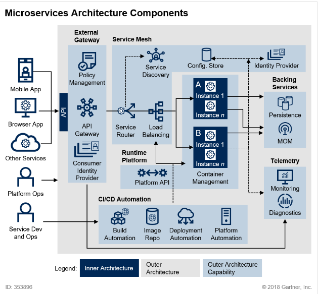

# 소프트웨어 아키텍처

## 기본 개념
- 시스템을 구성하는 요소들과 그 요소들 간의 관계, 그리고 이들로부터 형성된 시스템의 구조와 행위를 정의한 것
- "시스템이 어떻게 구성되고 상호작용하는가"를 정의한 설계의 상위 수준 관점
- 시스템의 전체 구조, 구성 요소, 그리고 그들 간의 관계를 정의하는 일종의 청사진(blueprint)

 

## 소프트웨어 아키텍처의 관점

### 애플리케이션(서비스) 내부 아키텍처 스타일
- 하나의 서비스(또는 모듈) 내부에서 코드와 계층이 어떻게 구성되고 의존하는지를 정의
- 예: Layered, Hexagonal, Clean Architecture
- 초점
    - 도메인 모델 설계
    - 모듈 간 의존성 방향
    - 유즈케이스별 비즈니스 로직 책임 분리
    - 프레임워크 독립성 확보 

### 시스템(엔터프라이즈) 아키텍처 스타일
- 여러 서비스들이 어떻게 연결되고 통신하며, 전체 시스템이 어떤 패턴으로 구성되는지 정의
- 예: Monolithic, Microservices, Event-Driven, SOA, Serverless, Modular Monolith
- 초점
    - 서비스 간 통신 (HTTP, gRPC, 메시징 등)
    - 데이터 분리 및 일관성 전략
    - API Gateway, Service Mesh, Event Bus
    - 배포, 모니터링, 장애 격리 구조

 

## 참고: MSA(Microservice Architecture) 구성

### 이너 아키텍처 (Inner Architecture)
- 각 마이크로서비스 내부 구조를 정의
- 즉, "하나의 서비스 안에서 코드가 어떻게 구성되는가"에 해당
- 관점
    - 도메인 모델링 및 유즈케이스 중심 설계
    - 포트/어댑터(헥사고날), 클린 아키텍처 적용
    - ORM, CQRS, 이벤트 소싱, Repository 등 내부 패턴
    - 테스트 전략 (단위, 통합, 컨트랙트 테스트)
    - 관련 스타일: Layered, Hexagonal, Clean Architecture

### 아우터 아키텍처 (Outer Architecture)
- 시스템 전반에서 서비스 간 관계와 통신 구조를 정의
- 즉, MSA 자체가 다루는 "시스템 레벨 아키텍처"에 해당
- 관점
    - 서비스 간 통신 프로토콜 (HTTP, gRPC, 메시징 등)
    - 서비스 디스커버리, API Gateway, Service Mesh
    - 인증·인가, 로깅, 트레이싱, 장애 격리
    - 데이터 일관성, 분산 트랜잭션(Saga, Outbox 등)
    - 배포 및 운영 (CI/CD, Canary, Blue–Green 등)
    - 관련 스타일: Event-Driven, Serverless, Modular Monolith

 

## 참고: 아키텍처 스타일 vs. 아키텍처 패턴

### 아키텍처 스타일 (Architecture Style)
- 시스템을 구성하는 전반적인 구조적 원리와 형태를 정의
- "시스템이 어떤 모양을 갖느냐(구조적 특성)"에 관한 것
- 예: Layered, Microservices, Event-Driven, Client–Server, Pipe-Filter

### 아키텍처 패턴 (Architecture Pattern)
- 아키텍처 스타일 안에서 특정 문제를 해결하기 위한 구체적인 구조적 해결책(솔루션)
- "그 구조 속에서 문제를 어떻게 해결하느냐(설계 원리)"에 관한 것
- 예: MVC, Repository, Domain Model, Event Sourcing, CQRS, Saga

### 아키텍처 스타일-패턴 비교 예시
| **구분**                               | **설명**                                                     | **예시**                    |
|--------------------------------------|------------------------------------------------------------|---------------------------|
| **Layered Architecture (스타일)**       | 계층 간 책임을 분리하여 상위 → 하위로 흐르는 구조                              | UI → Service → Repository |
| └ **MVC 패턴**                         | Presentation Layer 내부에서 UI 로직을 Model, View, Controller로 분리 |                           |
| **Microservices Architecture (스타일)** | 시스템을 여러 독립적인 서비스로 구성                                       | 회원/주문/결제 서비스 각각 독립 배포     |
| └ **Saga 패턴**                        | 분산 트랜잭션 문제를 해결하기 위한 마이크로서비스 간 보상 트랜잭션 처리 방식                |                           |
| **Event-Driven Architecture (스타일)**  | 이벤트 기반으로 서비스 간 비동기 통신                                      | Kafka, RabbitMQ           |
| └ **Event Sourcing 패턴**              | 상태 변경을 "이벤트 로그"로 기록하고, 재생하여 현재 상태 복원                       |                           |
| **Client–Server Architecture (스타일)** | 클라이언트와 서버가 요청/응답 형태로 통신                                    | 웹 브라우저 ↔ 백엔드              |
| └ **REST 패턴**                        | HTTP 기반으로 자원을 표현하고 조작하는 방식                                 |                           |

 

### 참고: 설계 패턴과 구현 패턴
| **항목** | **설계 패턴 (Design Pattern)**             | **구현 패턴 (Implementation Pattern)**                                                         |
|--------|----------------------------------------|--------------------------------------------------------------------------------------------|
| **개념** | 클래스/객체 수준에서의 협력 구조                     | 설계된 구조를 실제 코드/빌드 수준에서 구현하는 방법                                                              |
| **특징** | 언어나 기술에 독립적, 추상적, 시스템 구조 중심            | 언어·프레임워크 의존적, 코드 수준 적용, 구체적                                                                |
| **예시** | Singleton, Factory, Observer, Strategy | - Java enum으로 Singleton 구현 - Spring Bean으로 Factory 구현 - EventListener로 Observer 구현 |

 

## 시스템(엔터프라이즈) 아키텍처 스타일

### 모놀리식 아키텍처 (Monolithic Architecture)
- 모든 기능이 하나의 애플리케이션으로 구성된 구조
- 장점: 배포·테스트·개발이 단순
- 단점: 규모가 커질수록 빌드/배포 복잡, 일부 수정에도 전체 재배포 필요

### 마이크로서비스 아키텍처 (Microservices Architecture; MSA)
- 기능 단위를 독립적인 서비스로 분리하고, 서비스 간 API 통신(주로 HTTP/gRPC)을 통해 협업
- 장점: 독립 배포, 기술 다양성, 확장성 우수
- 단점: 서비스 간 통신 복잡, 데이터 일관성 관리 어려움
- 예: Netflix, Amazon, 쿠팡 등 대규모 분산 시스템

### 이벤트 주도 아키텍처 (Event-Driven Architecture; EDA)
- 서비스 간 동기 호출 대신 이벤트를 발행/구독(pub-sub) 방식으로 비동기 처리
- 장점: 느슨한 결합, 비동기 처리, 고확장성
- 단점: 트랜잭션 관리, 디버깅 어려움
- 예: Kafka, RabbitMQ, AWS SNS/SQS 기반 시스템

### 서버리스 아키텍처 (Serverless Architecture)
- 서버 인프라 관리 없이, 함수(Function) 단위로 클라우드에 배포 (예: AWS Lambda)
- 장점: 비용 효율, 자동 스케일링
- 단점: 콜드 스타트 문제, 상태 관리 어려움

 

## 애플리케이션(서비스) 내부 아키텍처 스타일

### 계층형 아키텍처 (Layered Architecture)
- 전통적인 3계층 또는 N계층 구조
    - UI → 비즈니스 로직 → 데이터 접근 계층으로 분리
    - 예: Spring에서 Controller - Service - Repository(DAO) 구조
- 장점: 관심사 분리, 유지보수 용이
- 단점: 계층 간 강한 의존성, 확장성/성능 한계

### 헥사고날 아키텍처 (Hexagonal Architecture, Ports and Adapters)
- 내부 도메인 로직과 외부 시스템(DB, API, UI 등)을 "포트/어댑터"로 분리
- 장점: 외부 의존성 교체 용이, 테스트 용이
- 단점: 작은 시스템에는 과도한 구조

### 클린 아키텍처 (Clean Architecture)
- 도메인 중심 설계(DDD) 철학에 기반하여, 의존성 방향을 "안쪽(도메인)"으로 제한
- 계층 구성: Frameworks → Interface Adapters → Use Cases → Entities
- 장점: 테스트 용이, 프레임워크 독립성 확보
- 단점: 설계 복잡도 증가, 초기 학습비용 큼
